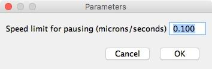
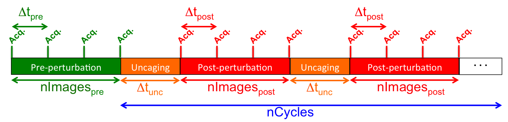

# KymoToolSet plugin

## Introduction

**KymoToolSet** is an **ImageJ plugin** aimed at helping the user with the characterisation of vesicular movements occurring within a cellular process. It is based on kymograph analysis and provides means to correlate tracking parameters to additional quantities such as calcium concentrations. It takes benefit of ImageJ built-in functions to process images and extract data, and relies on the KymoToolBox plugin for kymographs generation and analysis.

## Pre-requisites

### Having datasets properly formatted

This plugin ONLY deals with images acquired using the Metamorph software. It is designed to analysed three types of experiments: . For each type, a homemade journal has been generated that handles both devices’ activation and data collection in a normalised way. For each type of experiment, data naming convention is described hereafter:

#### Transport and synapses

In this type of experiment, two channels are used, one to collect the vesicular transport and one to acquire a structural marker (generally used to locate synapses). The structural marker is only acquired once, at the start of the experiment. To visualise vesicles, bleaching is performed: the region of interest where photomanipulation takes place is recorded.

Three files are saved per recorded cell, all cells from an experiment being saved in a single folder:

* Cell1-488.tif: *A single image containing the structural marker.*
* Cell1-561.tif: *A temporal stack containing the vesicular marker.*
* Cell1-roi.rgn: *The bleached region (Metamorph ROI file format).*

_Fields:_

Cell1: Cell number (from 1 to n, no padding).

488/561/roi: Nature of the data, either the structural marker, the vesicular marker or the bleached roi.

#### Transport and GCaMP

In this type of experiment, two channels are used, one to collect the vesicular transport and one to acquire the GCaMP signal. The automation used for data acquisition takes benefit of Metamorph’s "Multi-Dimensional Acquisition" module. Therefore, on tif file is saved per illumination setting and per timepoint. To visualise vesicles, bleaching is performed: the region of interest where photomanipulation takes place is recorded.

Overall four types of files are saved per recorded cell, all cells from an experiment being saved in a single folder:

* YY-MM-DD_ExperimentName_Condition1_Condition2_Cell1_w1Channel1_t1.TIF & YY-MM-DD_ExperimentName_Condition1_Condition2_Cell1_w2Channel2_t1.TIF: *Two files containing the two markers’ images for a single timepoint, one doublet per timepoint.*
* YY-MM-DD_ExperimentName_Condition1_Condition2_Cell1.nd: *Description file automatically generated by the Metamorph "MDA" module.*
* YY-MM-DD_ExperimentName_Condition1_Condition2_Cell1.rgn: *The bleached region (Metamorph ROI file format).*

_Fields:_

* YY-MM-DD: date.
* ExperimentName: Experiment’s name.
* Condition1: Experimental condition 1 (transfection, treatment etc…).
* Condition2: Experimental condition 2 (transfection, treatment etc…).
* Cell1: Cell number (from 1 to n, no padding).
* w1Channel1/w2Channel2: Illumination setting for the current channel.
* t1: Timepoint (from 1 to n, no padding).

#### Transport, GCaMP and uncaging

This type of experiment differs from the previous one in the way an additional  photomanipulation occurs during the experiment. At a predefined timepoint, ROIs corresponding to synapses are subjected to a 405nm laser diode shot, aimed at locally uncaging glutamate. Those regions are user-defined before the full acquisition sequence takes place, and stored for subsequent analysis. Data are stored the same way as described in the previous "Transport and GCaMP" section, an additional ROI being saved according to the following naming convention:

* YY-MM-DD_ExperimentName_Condition1_Condition2_Cell1_uncaging.rgn: *The uncaged regions (Metamorph ROI file format).*

### Installing the plugin

Drag-and-drop the plugin to the ImageJ toolbar: a save-dialog box should pop-up, asking where the plugin should be saved. By default it points at ImageJ installation folder, plugins sub-folder: if so, click on save or navigate to the adequate folder before pressing Ok.

### Installing additional required plugins

The KymoToolset plugin takes benefit of several additional ImageJ plugins that should be installed before using it. 

* **KymoToolBox**: this plugin generates kymographs from a stack of images and a user-defined region of interest. It also extracts quantitative data in order to characterise particles’ motion. This plugin from [this GitHub repository](https://github.com/fabricecordelieres/IJ-Plugin_KymoToolBox). Reference: Zala, D., Hinckelmann, M.-V., Yu, H., Lyra da Cunha, M. M., Liot, G., Cordelières, F. P., … Saudou, F. (2013). Vesicular glycolysis provides on-board energy for fast axonal transport. *Cell*, *152*(3), 479–91. http://doi.org/10.1016/j.cell.2012.12.029

* **Metamorph Companion**: this plugin is a collection of tools aimed at handling data generated using the Metamorph software. It is used to build stacks for individual images, and to import into ImageJ regions of interest generated using the acquisition software. This plugin is available from [this GitHub repository](https://github.com/fabricecordelieres/IJ-Plugin_Metamorph-Companion).

## Graphical User Interface

The toolset is composed of 8 tools. To launch the KymoToolSet, select the "KTS" entry within the ImageJ/Plugins menu: the following GUI should now be visible:

At start, all the options are activated. Once a data-containing folder  has been selected, options may be grayed depending on the type of experiment to be analysed.

### Generate images

#### What does it do ?

KymoToolSet was designed to handle three types of experiments related to vesicular trafficking. As a consequence, three types of input data are possible. Using this tool, the user is provided with a mean to prepare the data in a normalised way, for the subsequent steps of the analysis.

#### How does it do it (detailed description) ?

1. The user is requested to point at the **input folder**, which contains the serie of cells to analyze.
2. Based on the presence of specific files (nd files, uncaging ROIs etc…) the experiment’s type is defined and non-relevant buttons unactivated from the interface.
3. A parameters dialog box is displayed:

4. To optimise the analysis, the following parameters can be tweaked:
    1. *XY calibration*: physical size of a pixel, in XY (in microns).
    2. *Time interval*: delay between two series of acquisitions (in seconds).
    3. *Number of pre-bleach frames to remove*: as bleaching is used to clean-up the cell process and enhance vesicles’ visualisation, pre-bleach images do not contain relevant information for tracking. Those images might be removed from subsequent reconstructions.
    4. *Min/Max radius for wavelet*: to enhance vesicles’, a DoG filter (difference of Gaussians, [see here for more details](https://en.wikipedia.org/wiki/Difference_of_Gaussians)) is applied. The two parameters are used to defined the minimum and maximum standard deviations of the two filters used, expressed as a number of pixels.
    5. *Radius for top-hat*: once enhanced, vesicles are segregated from the surrounding background using a top-hat transform ([see here for more details](https://en.wikipedia.org/wiki/Top-hat_transform)).
    6. *Wavelength for vesicules/second channel*: the two fields are used to identify both channels to analyse. The provided input should allow distinguishing them.
5. Once the dialog box has been Oked, all parameters are output into the log window and saved within the input folder. This log files allows tracking all steps performed during the analysis together with the parameters that have been used. The filename is built as follows:
        * YYYY-MM-DD_HH-MM-SS_KymoToolSet.txt

_Fields:_
* YYYY-MM-DD: date of the analysis.
* HH-MM-SS: time of analysis.

6. Each cell is processed in turn, as follows:
    1. Images from both channels are loaded.
    2. In case the number of timepoints is not the same for both channels, as for the "Transport and synapses" case, the unique image is duplicated as many times as required to have both channels carrying the same number of images.
    3. Both temporal stacks are overlaid using the ImageJ "composite" mode, the first channel always being the vesicular marker.
    4. The Metamorph bleaching region is loaded onto the composite, using the "Metamorph Companion" plugin.
    5. Spatial and temporal calibration are applied to the composite.
    6. A subfolder is created in the input folder, carrying the name of the cell.
    7. A subfolder is created in it, named "Images".
    8. The composite image and the overlaid ROI are saved in the "Images" folder, as a tiff image packed into a zip file.
    9. The first image is extracted from the composite, and the bleached ROI drawn on it. The image is saved as a jpg file.
    10. The composite image is cropped according to the bleached ROI and pre-bleach images are removed.
    11. The vesicles’ channel is pre-processed (DoG and top-hat transform), according the the user-entered parameters.
    12. The cropped image and the overlaid ROI are saved in the "Images" folder, as a tiff image packed into a zip file.
    13. A maximum intensity projection of the former is performed, allowing to visualise the vesicles’ path. It is saved in the "Images" folder, as a tiff image packed into a zip file.
    14. In case of a "Transport, GCaMP and uncaging" experiment, the uncaging ROIs have been defined on the full image: they won’t fit on the cropped image. A step is therefore required to register those regions on the cropped image. The resulting ImageJ region file is saved into a newly created subfolder: “GCaMP_Uncaging” folder.
    15. Overall the following data structure is adopted:
        * Source_folder/Cell1/Images/Cell1.zip: *Composite of the full field of view, all timepoints, overlaid with the bleached ROI.*
        * Source_folder/Cell1/Images/Cell1.jpg: *First image of the stack, bleached zone overlaid.*
        * Source_folder/Cell1/Images/Cell1_crop.zip: *Composite of the bleached area, post-bleach timepoints only, overlaid with the bleached ROI.*
        * Source_folder/Cell1/Images/Cell1_crop_proj.zip: *Maximum intensity projection of the previous output, overlaid with the bleached ROI.*
        * Source_folder/Cell1/GCaMP_Uncaging/Cell1_Uncaging_rois.zip: *Uncaging ROIs, registered on the cropped version of the composite image, if applicable.*

_Fields:_
* Source_folder: Source folder, where original images are stored.
* Cell1: Cell number (from 1 to n, no padding).

#### How to use it (short description) ?

1. Click on the "Generate images" button.
2. Select the input folder, where the original data is stored: select one of the file within the folder to activate the "Ok" button.
3. Click on Ok: the parameter box should pop-up (see above for the meaning of each single value).
4. The process should start: images are automatically generated and saved, the log window reports about the advancement of the processing and contains potential error messages.

### Record paths

#### What does it do ?

Using this tool, the user will define the directions along which the vesicles are moving. Using the maximum intensity projection over the temporal stack, the trails along which vesicles have been travelling are visible. The user will define those trails, using a unique convention: all ROIs should be drawn from the cell body to the periphery. Once done, kymographs are automatically generated and vesicles’ path saved.

#### How does it do it (detailed description) ?

1. Depending on if this button is activated as a first step or a second step during the analysis process, two options are possible:
    1. If activated as a first step, the user is requested to point at the **input folder**, which contains the serie of cells to analyze.
    2. If activated as a second step, the user is asked to confirm the process should continue with the current input folder. If not, the user will have the opportunity to point at a different folder.
2. Each cell is processed in turn, as follows:

    1. The user is provided with both the jpg image and the cropped projection composite image, both generated using the "Generate images" tool.
    2. The user is requested to draw the cell process to analyze, starting from the cell body and ending at cell periphery.
    3. Once done, the user should click on Ok. Once Oked, a subfolder is created in the input folder, within the cell folder, named "Kymographs".
    4. The polyline ROI is saved, using ImageJ’s ROIs file format.
    5. Using the "KymoToolBox" plugin, the kymographs are generated as follows:
        1. For the vesicles’ channel, the path is recalled and a kymograph is directly generated.
        2. For the additional channel, two kymographs are generated. The first one is created by recalling the original stroke: it allows generating a kymograph within the cellular process. The second one is created by blackening pixels under the stroke, then extending its width to five time its original thickness: it allows generating a kymograph containing mainly information located within the synapses.
        3. Finally, all three kymographs are overlaid and saved as a composite in the previous folder as a tiff image packed into a zip file.
    6. Overall the following data structure is adopted:
            * Source_folder/Cell1/Kymographs/Cell1_kymo_path.roi: *ImageJ ROI containing the polyline object drawn by the user.*
            * Source_folder/Cell1/Kymographs/Cell1_kymo.zip: *Kymograph generated for the current cell.*

_Fields:_
* Source_folder: Source folder, where original images are stored.
* Cell1: Cell number (from 1 to n, no padding).

#### How to use it (short description) ?

1. Click on the "Record path" button.
2. Either select the input folder, where the original data is stored (select one of the file within the folder to activate the "Ok" button), or confirm the currently selected one.
3. Click on Ok: the first images should be displayed (cell overview and cropped-projected image).
4. Follow the instructions: "Using the segmented line tool, draw the vesicles' paths ON THE SMALLER IMAGE, from the cell body towards the periphery, adjust the line width by double-clicking on the drawing tool, then click on Ok". Tips: the width of the polyline can be modified by double-clicking on the polyline tool. An adjustment box should pop-up. Each individual channel might be turned on/off using ImageJ’s channels tool (Image/Color/Channels tools).
5. Repeat until all cells have been processed: the log window reports about the advancement of the processing and contains potential error messages.

### Record segments/Analyse kymos

#### What does it do ?

This tool collects the positions of the vesicles over the kymograph. The user define those trails, by drawing each of their segments. Once done, tracks are automatically analysed: quality control images and data tables are generated.

#### How does it do it (detailed description) ?

1. Depending on if this button is activated as a first step or a second step during the analysis process, two options are possible:
    1. If activated as a first step, the user is requested to point at the **input folder**, which contains the serie of cells to analyze.
    2. If activated as a second step, the user is asked to confirm the process should continue with the current input folder. If not, the user will have the opportunity to point at a different folder.
2. A parameters dialog box is displayed:

3. To optimise the analysis and its outputs, the following parameters can be tweaked:
    1. *Speed limit for pausing*: velocity below which the vesicle is considered to be pausing (in microns/second).
    2. *Line width for display*: width of the lines to be drawn on the annotated kymograph (in pixels).
4. Each cell is processed in turn, as follows:

    1. The user is provided with the kymograph: on this composite image, only the vesicles’ channel is activated.
    2. The user is requested to draw each vesicle’s path from top to bottom, then add the corresponding ROI to the ROI Manager by pressing  the ‘t’ key.
    3. Once all relevant vesicles’ paths have been drawn, the user is requested to press on the "Ok" button.
    4. First, the ROI Manager content is saved.
    5. As a second step, the "KymoToolBox" plugin is called to perform kymograph analysis and generate quality control images.
    6. Overall the following data structure is adopted:
        * Source_folder/Cell1/Kymographs/Cell1_kymo_segments_rois.zip: *ImageJ ROI containing the polyline objects drawn by the user over the vesicles’ paths.*
        * Source_folder/Cell1/Kymographs/Cell1_annotated.zip: *Annotated kymograph generated from the original kymograph to which is overlaid the vesicles’ traces. Each trace is composed of segment colored after the direction of the movement.*
            * *Blue**: pausing vesicle;*
            * *Red**: inward movement (towards the cell body);*
            * *Green**: outward movement (away from the cell body).*
        * Source_folder/Cell1/Kymographs/Cell1_data.xls: *Tabulation separated values-file containing all distances, velocities and frequencies of transitions for each single segment for each vesicle.*
        * Source_folder/Cell1/Kymographs/Cell1_coord.xls: *Tabulation separated values-file containing the extrapolated XY coordinates for each vesicles. Caution: as kymographs are generated from the full width of the vesicles path, this file contains an approximation of coordinates, localisation precision depending on the path’s width.*

_Fields:_
* Source_folder: Source folder, where original images are stored.
* Cell1: Cell number (from 1 to n, no padding).

#### What kind of data are extracted from the kymographs ?

Example of "Data" file: Cell1_data.xls

To make the understanding of the following section easier, we will define the term "track" as referring to the full path or user defined selection that describes the movement of one object. A “segment” will be defined as the portion of the track between two changes of state i.e. change of direction and change from the mobile state to a pausing state (or the reverse). It contains the following measurements, expressed using the image’s calibration units:

* *Kymo nb*: number of the track.
* *Mean Speed*: Cum Dist/Ttl Time (therefore includes the pausing times).
* *Mean Speed In*: Cum Dist In/Time In (therefore excludes the pausing times).
* *Mean Speed Out*: Cum Dist Out/Time Out (therefore excludes the pausing times).
* *Cum Dist*: sum of all the lengths of each single "segment".
* *Cum Dist In*: sum of all the lengths of each single inward "segment".
* Cum Dist Out’: sum of all the lengths of each single outward "segment";
* *Min Dist Start-End*: straight distance between the first and the last points of the "track".
* *Persistence*: Cum Dist/Min Dist Start-End.
* *Freq XXX>YYY (ex: "Freq In>Out")*: number of transitions from one state (moving outward, moving inward or pausing) to another, per unit of time. It is calculated by counting the number of transitions then dividing it by the total number of timepoints. The following table presents all possible cases, using the color code from the annotated kymographs:

* Ttl Time: total duration along which the vesicle has been followed.
* *% Time In, % Time Out, % Time Pause*: number of timepoints where the vesicle is going inward/outward or pausing, divided by the total number of timepoints.

NB: some of the measurements are displayed with a value of zero. This is totally normal as the table contains both measurements for single segments (not tagged lines) and others for the full track (tagged with ">>>><<<<"). Percentage of transitions or average speeds can’t be calculated for single segments: in those cases, the zero value is therefore used.

#### How to use it (short description) ?

1. Click on the "Record segments/Analyse kymos" button.
2. Either select the input folder, where the original data is stored (select one of the file within the folder to activate the "Ok" button), or confirm the currently selected one.
3. Click on Ok: the parameter box should pop-up (see above for the meaning of each single value).
4. Click on Ok: the first image should be displayed (kymograph as an overlay where only the first channel displayed).
5. Follow the instructions: "Using the segmented line tool, draw each single vesicle' path, from top to bottom, add in turn each path to the ROI Manager by pressing 't', then click on Ok". 
6. Repeat until all cells have been processed: the log window reports about the advancement of the processing and contains potential error messages.

### Analyse flux

#### What does it do ?

This button generates for each cell a table where the number of vesicles is logged for each time point. Additional data are logged: the delta of this number between two consecutive time points and the surface in which those parameters are determined.

#### How does it do it (detailed description) ?

1. Depending on if this button is activated as a first step or a second step during the analysis process, two options are possible:
    1. If activated as a first step, the user is requested to point at the **input folder**, which contains the serie of cells to analyze.
    2. If activated as a second step, the user is asked to confirm the process should continue with the current input folder. If not, the user will have the opportunity to point at a different folder.
2. Each cell is processed in turn, as follows:
    1. A subfolder is created in the input folder, within the cell folder, named "Flux".
    2. The cropped original composite image is loaded and the path ROI recalled (Source_folder/Cell1/Images/Cell1_crop.zip and Source_folder/Cell1/Kymographs/Cell1_kymo_path.roi, respectively).
    3. The polyline ROI is converted to an area and its surface determined.
    4. The Source_folder/Cell1/Kymographs/Cell1_coord.xls extrapolated coordinates data file is loaded: it contains one entry per time point where a vesicles’ track has been drawn. Counting the number of vesicle present on the image per time point is achieved by counting the number of entries in that file, for each time point. The delta of this number is also calculated and logged, together with the region’s area in an output file saved in the "Flux" folder.
    5. Overall the following data structure is adopted:
        * Source_folder/Cell1/Flux/Cell1_flux_data.xls: *Tabulation separated values-file containing for each time point the number of vesicles, the delta of the number of vesicles between two consecutive timepoints (except for the first one where NaN/Not a number is logged) and the surface of the ROI in which this number has been determined.*

_Fields:_
* Source_folder: Source folder, where original images are stored.
* Cell1: Cell number (from 1 to n, no padding).

#### How to use it (short description) ?

1. Click on the "Analyse flux" button.
2. Either select the input folder, where the original data is stored (select one of the file within the folder to activate the "Ok" button), or confirm the currently selected one.
3. Click on Ok: the process being fully automated based on existing outputs, no additional user-input is required. No image nor data tables are displayed.The log window reports about the advancement of the processing and contains potential error messages.

### Analyse GCaMP/Marker (only available for "Transport and GCaMP" experiments)

#### What does it do ?

This tool allows extracting and correlating GCaMP quantification data to movement-related information (already extracted from the kymographs). It outputs several tables linking the intensities within a dendritic and a **global** synaptic region to individual vesicles’ instant speeds.

#### How does it do it (detailed description) ?

1. Depending on if this button is activated as a first step or a second step during the analysis process, two options are possible:
    1. If activated as a first step, the user is requested to point at the **input folder**, which contains the serie of cells to analyze.
    2. If activated as a second step, the user is asked to confirm the process should continue with the current input folder. If not, the user will have the opportunity to point at a different folder.
2. A parameters dialog box is displayed:

3. To optimise the analysis and its outputs, the following parameter can be tweaked:
    * *Speed limit for pausing*: velocity below which the vesicle is considered to be pausing (in microns/second).
4. Each cell is processed in turn, as follows:
    1. A subfolder is created in the input folder, within the cell folder, named "GCaMP".
    2. The cropped original composite image is loaded and the path ROI recalled (Source_folder/Cell1/Images/Cell1_crop.zip and Source_folder/Cell1/Kymographs/Cell1_kymo_path.roi, respectively).
    3. The original path is converted into an area which will be designated as the dendritic area.
    4. The former region is dilated to five times its original width: it constitutes the dendritic and synaptic area.
    5. The synaptic area is obtained by making the difference between both regions
    6. The average intensity of both the dendritic and the synaptic areas is determined on the cropped image, for all time points, after its second channel (marker/GCaMP) has been activated.
    7. For each time point, the following informations are logged to a first file:
        1. *Time point*, in seconds.
        2. *Average intensity within the dendritic regio*n.
        3. *DeltaF within the dendritic region*: average intensity - minimum intensity over all time points within the dendritic region.
        4. *DeltaF/F within the dendritic region*: DeltaF/minimum intensity over all time points within the dendritic region.
        5. *DeltaF within the synaptic region*: average intensity - minimum intensity over all time points within the synaptic region.
        6. *DeltaF/F within the synaptic region*: DeltaF/minimum intensity over all time points within the synaptic region.
    8. The intensity-based values are then correlated to the movement-related data. To this aim, Source_folder/Cell1/Kymographs/Cell1_coord.xls file containing the extrapolated coordinate data is loaded. For each time point, in addition to intensity-based data, the following informations are logged to a second file:
        1. *Number of vesicles*: number of counted vesicles for the current time point.
        2. *Number of pausing vesicles*: number of vesicles which speed is below the user-defined speed limit.
        3. *Percentage of pausing vesicles*: number of pausing vesicle/total number of vesicles at the current time point.
        4. For each detected vesicle, a column is added to the table. In case the vesicle appears at the current time point, its instant speed is logged on the corresponding row.
        5. Three additional files are generated. They carry the same content as the former one, except speed have been erased if not inward for the first, if not outward for the second and not pausing for the third. Those files therefore contain correlated data in a directionally-dependent way.
    9. Overall the following data structure is adopted:
        * Source_folder/Cell1/GCaMP/Cell1_GCaMP_data.xls: *Tabulation separated values-file containing for each time point the average intensity, the DeltaF and DeltaF/F values for both the dendritic and the synaptic regions.*
        * Source_folder/Cell1/GCaMP/Cell1_GCaMP_data_correl_speed.xls: *Tabulation separated values-file containing the same information as the above file to which is added the number of vesicles, the number of pausing vesicles, the percentage of pausing vesicles, and the instant speeds of vesicles for each time point.*
        * Source_folder/Cell1/GCaMP/Cell1_GCaMP_data_correl_speed_IN.xls: *Same as the data_correl_speed file, except only inward speeds have been logged.*
        * Source_folder/Cell1/GCaMP/Cell1_GCaMP_data_correl_speed_OUT.xls: *Same as the data_correl_speed file, except only outward speeds have been logged*
        * Source_folder/Cell1/GCaMP/Cell1_GCaMP_data_correl_speed_PAUSE.xls: *Same as the data_correl_speed file, except only pauses-related data have been logged*

_Fields:_
* Source_folder: Source folder, where original images are stored.
* Cell1: Cell number (from 1 to n, no padding).

#### How to use it (short description) ?

1. Click on the "Analyse GCaMP/Marker" button.
2. Either select the input folder, where the original data is stored (select one of the file within the folder to activate the "Ok" button), or confirm the currently selected one.
3. Click on Ok: the parameter box should pop-up (see above for the meaning of each single value).
4. Click on Ok: the process being fully automated based on existing outputs, no additional user-input is required. No image nor data tables are displayed.The log window reports about the advancement of the processing and contains potential error messages.

### Analyse GCaMP/Uncaging (only available for "Transport, GCaMP and uncaging" experiments)

#### What does it do ?

This tool allows extracting and correlating GCaMP quantification data to movement-related information (already extracted from the kymographs). It outputs several tables linking the intensities within a dendritic region and **individual** synaptic regions to individual vesicles’ instant speeds.

#### How does it do it (detailed description) ?

1. Depending on if this button is activated as a first step or a second step during the analysis process, two options are possible:
    1. If activated as a first step, the user is requested to point at the **input folder**, which contains the serie of cells to analyze.
    2. If activated as a second step, the user is asked to confirm the process should continue with the current input folder. If not, the user will have the opportunity to point at a different folder.
2. A parameters dialog box is displayed:

3. The uncaging experiments rely on a serie of acquisitions where a first set of images is acquired: this is the pre-perturbation sequence. In a second step, the uncaging takes place. In a third step, images sequences of images are acquired. Steps 2 and 3 are repeated. The following scheme summarizes the workflow and points out the parameters that are required to be filled by the user:

    1. *Number of pre-perturbation images*: this parameter corresponds to nImagespre.
    2. *Time interval between pre-perturbation sequences*: this parameter corresponds to Δtpre.
    3. *Duration of a single perturbation*: this parameter corresponds to Δtunc.
    4. *Number of perturbation cycles*: this parameter corresponds to nCycles. One cycle is made of one perturbation and one post-perturbation sequence.
    5. *Number of post-perturbation images per cycle*: this parameter corresponds to nImagespost.
    6. *Time interval between post-perturbation sequences*: this parameter corresponds to Δtpost.
    7. *Speed limit for pausing*: velocity below which the vesicle is considered to be pausing (in microns/second).
4. Each cell is processed in turn, as follows:
    1. A subfolder is created in the input folder, within the cell folder, named "GCaMP_Uncaging".
    2. The cropped original composite image is loaded and the path ROI recalled (Source_folder/Cell1/Images/Cell1_crop.zip and Source_folder/Cell1/Kymographs/Cell1_kymo_path.roi, respectively).
    3. The original path is converted into an area which will be designated as the dendritic area.
    4. The ROIs where uncaging took place have already been converted into ImageJ file format: they are loaded from Source_folder/Cell1/GCaMP_Uncaging/Cell1_Uncaging_rois.zip.
    5. The average intensity of both the dendritic and the uncaged/synaptic areas is determined on the cropped image, for all time points, after its second channel (marker/GCaMP) has been activated.
    6. For each time point, the following informations are logged to a first file:
        1. *Time point*, in seconds. The timeline is fully calculated from the user-provided informations about the acquisition sequence.
        2. *Average intensity within the dendritic regio*n.
        3. *DeltaF within the dendritic region*: average intensity - minimum intensity over all time points within the dendritic region.
        4. *DeltaF/F within the dendritic region*: DeltaF/minimum intensity over all time points within the dendritic region.
        5. For each uncaged region:
            1. *DeltaF within the uncaged region*: average intensity - minimum intensity over all time points within the *uncaged* region.
            2. *DeltaF/F within the uncaged region*: DeltaF/minimum intensity over all time points within the *uncaged* region.
    7. The intensity-based values are then correlated to the movement-related data. To this aim, Source_folder/Cell1/Kymographs/Cell1_coord.xls file containing the extrapolated coordinate data is loaded. For each time point, in addition to intensity-based data, the following informations are logged to a second file:
        1. *Number of vesicles*: number of counted vesicles for the current time point.
        2. *Number of pausing vesicles*: number of vesicles which speed is below the user-defined speed limit.
        3. *Percentage of pausing vesicles*: number of pausing vesicle/total number of vesicles at the current time point.
        4. For each detected vesicle, a column is added to the table. In case the vesicle appears at the current time point, its instant speed is logged on the corresponding row. The initial speed extracted from the "KymoToolBox" output supposed a unique time interval between acquisition. In this output, the velocity is adjusted depending on the true time line, as calculated from user-entered information.
        5. Three additional files are generated. They carry the same content as the former one, except speed have been erased if not inward for the first, if not outward for the second and not pausing for the third. Those files therefore contain correlated data in a directionally-dependent way.
    8. Overall the following data structure is adopted:
        * Source_folder/Cell1/GCaMP_Uncaging/Cell1_GCaMP_data.xls: *Tabulation separated values-file containing for each time point the average intensity, the DeltaF and DeltaF/F values for both the dendritic and the synaptic regions.*
        * Source_folder/Cell1/GCaMP_Uncaging/Cell1_GCaMP_data_correl_speed.xls: *Tabulation separated values-file containing the same information as the above file to which is added the number of vesicles, the number of pausing vesicles, the percentage of pausing vesicles, and the instant speeds of vesicles for each time point.*
        * Source_folder/Cell1/GCaMP_Uncaging/Cell1_GCaMP_data_correl_speed_IN.xls: *Same as the data_correl_speed file, except only inward speeds have been logged.*
        * Source_folder/Cell1/GCaMP_Uncaging/Cell1_GCaMP_data_correl_speed_OUT.xls: *Same as the data_correl_speed file, except only outward speeds have been logged*
        * Source_folder/Cell1/GCaMP_Uncaging/Cell1_GCaMP_data_correl_speed_PAUSE.xls: *Same as the data_correl_speed file, except only pauses-related data have been logged*

_Fields:_
* Source_folder: Source folder, where original images are stored.
*Cell1: Cell number (from 1 to n, no padding).

#### How to use it (short description) ?

1. Click on the "Analyse GCaMP/Uncaging" button.
2. Either select the input folder, where the original data is stored (select one of the file within the folder to activate the "Ok" button), or confirm the currently selected one.
3. Click on Ok: the parameter box should pop-up (see above for the meaning of each single value).
4. Click on Ok: the process being fully automated based on existing outputs, no additional user-input is required. No image nor data tables are displayed.The log window reports about the advancement of the processing and contains potential error messages.

### Pull data

#### What does it do ?

This tools allows concatenating tabulation-separated data tables from all cells and saving them into additional files.

#### How does it do it (detailed description) ?

1. Depending on if this button is activated as a first step or a second step during the analysis process, two options are possible:
    1. If activated as a first step, the user is requested to point at the **input folder**, which contains the serie of cells to analyze.
    2. If activated as a second step, the user is asked to confirm the process should continue with the current input folder. If not, the user will have the opportunity to point at a different folder.
2. A subfolder is created in the input folder, named "_Pulled_data".
3. The plugin takes in turn relevant data file for each individual cell, adds the cells number as a tag on a new column placed on the left-most side of the table, and saves the resulting file in the output folder.
4. Overall the following data structure is adopted:
        * Movement and flux-related data:
            * Source_folder/_Pulled_data/Kymo_data.xls
            * Source_folder/_Pulled_data/Kymo_coord.xls
            * Source_folder/_Pulled_data/Flux_data.xls
        * Simple GCaMP-related data (if applicable):
            * Source_folder/_Pulled_data/GCaMP_data.xls
            * Source_folder/_Pulled_data/GCaMP_data_correl_speed.xls
            * Source_folder/_Pulled_data/GCaMP_data_correl_speed_IN.xls
            * Source_folder/_Pulled_data/GCaMP_data_correl_speed_OUT.xls
            * Source_folder/_Pulled_data/GCaMP_data_correl_speed_PAUSE.xls
        * GCaMP and uncaging-related data (if applicable):
            * Source_folder/_Pulled_data/GCaMP_Uncaging_data.xls
            * Source_folder/_Pulled_data/GCaMP_Uncaging_data_correl_speed.xls
            * Source_folder/_Pulled_data/GCaMP_Uncaging_data_correl_speed_IN.xls
            * Source_folder/_Pulled_data/GCaMP_Uncaging_data_correl_speed_OUT.xls
            * Source_folder/_Pulled_data/GCaMP_Uncaging_data_correl_speed_PAUSE.xls
            * Source_folder/_Pulled_data/All_in_one.pzfx
                * *All previous data file crunched into a single, multi-table GraphPad Prism file**.*

_Field:_
* Source_folder: Source folder, where original images are stored.

#### How to use it (short description) ?

1. Click on the "Pull data" button.
2. Either select the input folder, where the original data is stored (select one of the file within the folder to activate the "Ok" button), or confirm the currently selected one.
3. Click on Ok: the process being fully automated based on existing outputs, no additional user-input is required. No image nor data tables are displayed.The log window reports about the advancement of the processing and contains potential error messages.

### Re-analyse data on a timeframe

#### What does it do ?

This tool allows temporal cropping of data: it takes as input parameters a start and an end time point and saves/re-analyse the already analysed data only within this time frame. No data is overwritten: only data copy is used.

#### How does it do it (detailed description) ?

1. Depending on if this button is activated as a first step or a second step during the analysis process, two options are possible:
    1. If activated as a first step, the user is requested to point at the **input folder**, which contains the serie of cells to analyze.
    2. If activated as a second step, the user is asked to confirm the process should continue with the current input folder. If not, the user will have the opportunity to point at a different folder.
2. A parameters dialog box is displayed:

3. To optimise the analysis and its outputs, the following parameter can be tweaked:
    1. *Start timepoint*: the first time point to include for re-analysis (inclusive).
    2. *End timepoint*: the last time point to include for re-analysis (inclusive).
    3. *Speed limit for pausing*: velocity below which the vesicle is considered to be pausing (in microns/second).
    4. *Line width for display*: width of the lines to be drawn on the annotated kymograph (in pixels).
4. Each cell is processed in turn, as follows:
    1. A subfolder is created in the input folder, named "Re-Analysis_start-end".
    2. Within this subfolder, another subfolder is created, named after the cell.
    3. All images files are copied from the original Source_folder/Cell1/Images folder to the Source_folder/Re-Analysis_start-end/Cell1/Images folder.
    4. All ROIs files are copied from the original Source_folder/Cell1/Kymographs folder to the Source_folder/Re-Analysis_start-end/Cell1/Kymographs folder.
    5. If applicable, the registered uncaging ROIs are copied from the original Source_folder/Cell1/GCaMP_Uncaging folder to the Source_folder/Re-Analysis_start-end/Cell1/GCaMP_Uncaging folder.
    6. The ROIs file containing the user-defined segments  is loaded (Source_folder/Re-Analysis_start-end/Cell1/Kymographs/Cell1_kymo_segments_rois.zip) and modified to encompass only events occurring within the time frame. The file is overwritten.
    7. Kymograph analysis is run.
    8. For flux analysis, GCaMP analysis and GCaMP+uncaging analysis (both, if applicable), all the original data files are loaded, and only row corresponding to the time interval are retained in files saved within the relevant Source_folder/Re-Analysis_start-end/Cell1 subfolders.
    9. Overall the following data structure is adopted:
        * Source_folder/Re-Analysis_start-end/Cell1/
_Fields:_
* Source_folder: Source folder, where original images are stored.
* Cell1: Cell number (from 1 to n, no padding).
* start: Start time point.
* End: End time point.
5. Once all cells have been reviewed, the "Pull data" function is called.

#### How to use it (short description) ?

1. Click on the "Re-analyse data on a timeframe" button.
2. Either select the input folder, where the original data is stored (select one of the file within the folder to activate the "Ok" button), or confirm the currently selected one.
3. Click on Ok: the parameter box should pop-up (see above for the meaning of each single value).
4. Click on Ok: the process being fully automated based on existing outputs, no additional user-input is required. The log window reports about the advancement of the processing and contains potential error messages.
